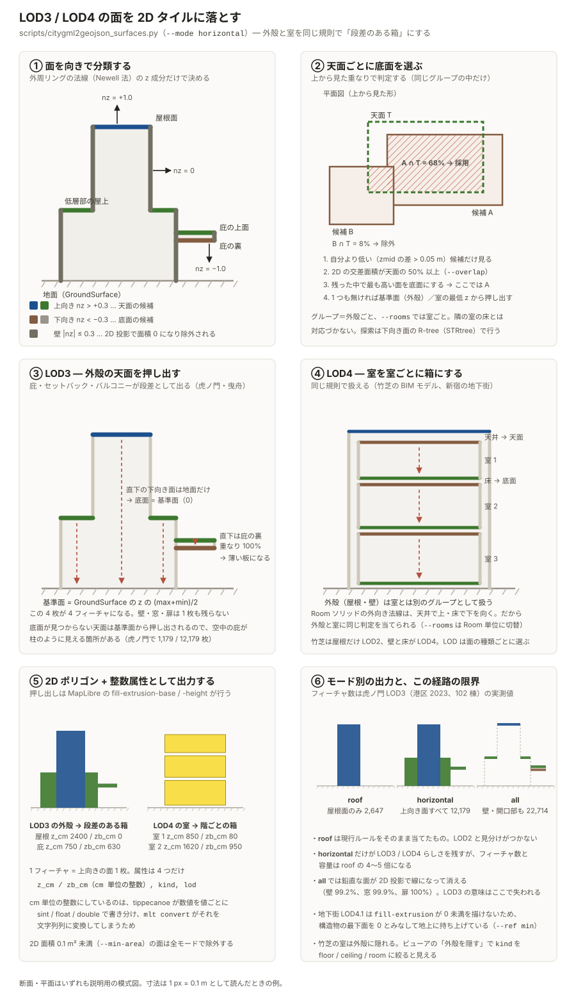
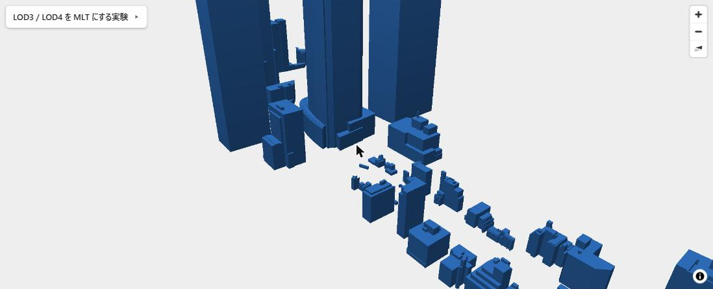
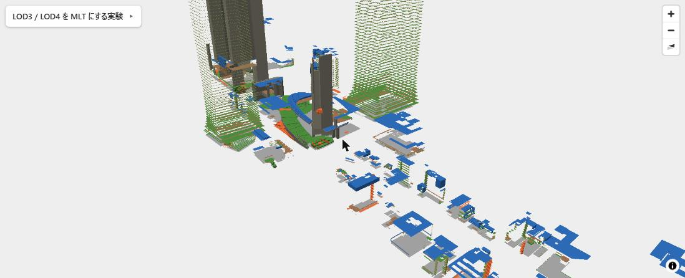
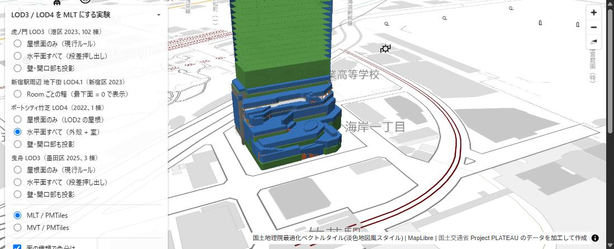
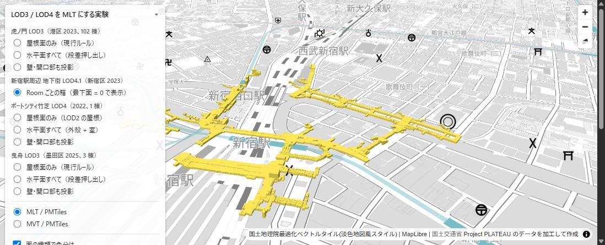
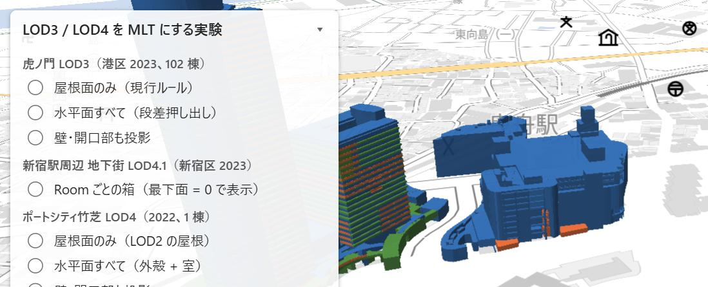

# LOD3 / LOD4 を MLT にする実験（2026-09-20）

[Issue #4](https://github.com/shiwaku/plateau-lod2-mlt-pipeline/issues/4) の「本パイプラインでは LOD3 / LOD4 を表現できない」という結論を、
実データで確かめた記録。千代田区 LOD2 の本番出力（`dist/chiyoda-lod2.*`）は変えず、実験用の変換スクリプトとタイルを別に追加した。

- 変換: [`scripts/citygml2geojson_surfaces.py`](../scripts/citygml2geojson_surfaces.py)（実験用。本番の `citygml2geojson.py` は変更なし）
- タイル: `dist/{toranomon-lod3,hikifune-lod3,takeshiba-lod4}-{roof,horizontal,all}.*.pmtiles`、`dist/shinjuku-ubld-lod4-rooms.*.pmtiles`
- ビューア: [`lod3-lod4.html`](../lod3-lod4.html)（データセットと MLT / MVT を切り替え、面の種類で色分け）

## 1. 結論

**MLT にすること自体はできる。できないのは LOD3 / LOD4 の「らしさ」を保つこと。**

- `tippecanoe → MVT → mlt convert` の経路は、面ごとの `z_cm`（天面）/ `zb_cm`（底面）/ `kind`（面の種類）という属性構成でも問題なく通る。MapLibre で `fill-extrusion-base` / `-height` に渡して描画でき、MLT と MVT で読み出される属性・フィーチャ数は完全に一致した（4 節）
- 一方、LOD3 の本体である壁面・窓・ドアは 2D 投影で **99% 以上が面積 0 になって消える**（3.3 節）。壁を入れる方式は視覚的にも破綻する
- 実用になり得るのは「上向きの面（屋根・バルコニー上面・床）を、その直下の下向きの面（庇の裏・床下・地面）から押し出す」方式。LOD3 の庇・セットバック・バルコニー、BIM 由来 LOD4 の階ごとの床板、地下街の Room がそれぞれ「段差のある箱」として出る。ただしフィーチャ数・タイル容量は屋根面のみの 4〜5 倍
- 地下街 LOD4.1 は MapLibre の `fill-extrusion` が 0 未満を描けないため、構造物の最下面を 0 とみなして地上に持ち上げて表示するしかない

つまり本リポジトリの目的（LOD2 屋根面の MLT 化）を LOD3 / LOD4 に広げる意味は薄く、LOD3 / LOD4 を LOD3 / LOD4 として見せるなら 3D Tiles の領域という Issue #4 の結論は変わらない。

## 2. 方法

### 2.1 対象データ

| データ | 出典 | 対象 |
| --- | --- | --- |
| 虎ノ門 LOD3 | 港区 2023（`13103_minato-ku_pref_2023_citygml_2_op`）のメッシュ 53393599 / 53393690 / 53394509 / 53394600 | `lod3*` を持つ建築物 102 棟（README の整備量と一致） |
| 曳舟 LOD3 | 墨田区 2025（`13107_sumida-ku_pref_2025_citygml_1_op`）のメッシュ 53394655 / 53394665 | 3 棟（東京曳舟病院、イトーヨーカドー曳舟店、イーストコア曳舟） |
| ポートシティ竹芝 LOD4 | [東京都 23 区 ポートシティ竹芝 建築物モデル（LOD4）（2022 年度）](https://www.geospatial.jp/ckan/dataset/plateau-tokyo23ku-2023-lod4) `53393680_bldg_6697_lod4.2_op.gml` | 1 棟（BIM / IFC 由来、Room 1,092 室、面 13 万） |
| 新宿駅周辺 地下街 LOD4.1 | 新宿区 2023 `udx/ubld/53394536_ubld_6697_op.gml` | `uro:UndergroundBuilding` 1 体（Room 153 室） |

### 2.2 変換方式（3 通り）

すべて 2D ポリゴン + 整数属性。`z_cm` = 天面、`zb_cm` = 底面（基準面からの cm）、`kind` = 面の種類、`lod` = 使った LOD。

| 方式 | 内容 |
| --- | --- |
| `roof` | `RoofSurface` のみ、最上位 LOD の面を使う。底面は 0。**現行ルールを LOD3 に適用したもの** |
| `horizontal` | 法線が上向き（nz > 0.3）の面すべてを天面とし、その 2D 形状の 50% 以上を覆う直下の下向き面（nz < −0.3）のうち最も高いものを底面にする。見つからなければ地面。Room は室ごとに対応付ける |
| `all` | 壁・窓・ドアも含む全ポリゴンを 2D 投影し、`zb_cm` / `z_cm` = z の最小 / 最大。面積 0.1 m² 未満は除外し、その数を数える |

面の向きは外周リングの法線（Newell 法）から取る。CityGML の外向き法線の規約により、建物外殻では屋根・バルコニー上面が上向き、庇の裏・地面が下向き、Room ソリッドでは天井が上向き、床が下向きになるので、同じ規則で外殻と室の両方を扱える。

PLATEAU は LOD2 と LOD3 の外殻を別々の `boundedBy` 要素で持つため、面の種類ごとに最上位 LOD だけを残して二重の外殻を避ける（竹芝は屋根だけ LOD2、他は LOD4 という構成なので「種類ごと」が必要）。

規則の全体を断面・平面でまとめたもの:



### 2.3 タイル化

`scripts/build_tiles.sh` に環境変数 `TIPPE_EXTRA` を追加し（本番の挙動は不変）、`--attribute-type=zb_cm:int` を渡した。ズームは 12〜17。

```sh
python scripts/citygml2geojson_surfaces.py <minato-2023>/udx/bldg/53393690_bldg_6697_op.gml ... \
    -o build/toranomon-lod3-horizontal.ndjson --mode horizontal --require-lod 3
python scripts/citygml2geojson_surfaces.py <shinjuku-2023>/udx/ubld/53394536_ubld_6697_op.gml \
    -o build/shinjuku-ubld-lod4-rooms.ndjson --mode horizontal --rooms --ref min
MINZOOM=12 MAXZOOM=17 TIPPE_EXTRA="--attribute-type=zb_cm:int" \
    bash scripts/build_tiles.sh build/toranomon-lod3-horizontal.ndjson toranomon-lod3-horizontal
```

## 3. 結果

### 3.1 フィーチャ数とタイル容量

| データ | 方式 | フィーチャ | MLT / PMTiles | MVT / PMTiles | MLT / MVT |
| --- | --- | ---: | ---: | ---: | ---: |
| 虎ノ門 LOD3（102 棟） | roof | 2,647 | 118 KB | 190 KB | 0.62 |
| | horizontal | 12,179 | 517 KB | 756 KB | 0.68 |
| | all | 22,714 | 875 KB | 1,308 KB | 0.67 |
| 曳舟 LOD3（3 棟） | roof | 1,072 | 57 KB | 72 KB | 0.80 |
| | horizontal | 9,757 | 289 KB | 351 KB | 0.82 |
| | all | 15,650 | 359 KB | 545 KB | 0.66 |
| 竹芝 LOD4（1 棟） | roof | 142 | 29 KB | 21 KB | 1.40 |
| | horizontal | 3,082 | 201 KB | 220 KB | 0.92 |
| | all | 7,005 | 318 KB | 396 KB | 0.80 |
| 新宿 地下街 LOD4.1 | horizontal + rooms | 4,621 | 240 KB | 369 KB | 0.65 |

MLT は MVT より 2〜3 割小さいが、竹芝の屋根面のみ（142 面）のような極小データでは MLT の方が大きい。
`horizontal` は `roof` に対しフィーチャで 4.6 倍（虎ノ門）〜9 倍（曳舟）、容量で 4.4 倍〜5 倍になる。

### 3.2 `horizontal` 方式の内訳

| データ | 上向き面 | 下向き面 | 壁（除外） | 底面が見つかった天面 | 見つからず地面から |
| --- | ---: | ---: | ---: | ---: | ---: |
| 虎ノ門 LOD3 | 17,302 | 13,774 | 83,353 | 11,000 | 1,179 |
| 曳舟 LOD3 | — | — | — | 9,480 | 277 |
| 竹芝 LOD4 | 20,697 | 21,603 | 93,182 | 2,948 | 134 |
| 新宿 地下街 | 5,565 | 3,190 | 14,105 | 4,053 | 568 |

底面が見つからなかった天面（1 割前後）は地面から押し出されるので、実際には空中にある庇が柱のように見える箇所がある。

### 3.3 `all` 方式で消える面

| データ | 壁 | 窓 | ドア | 設備（BuildingInstallation） |
| --- | ---: | ---: | ---: | ---: |
| 虎ノ門 LOD3 | 59,861 / 60,371（99.2%） | 10,420 / 10,434（99.9%） | 706 / 706（100%） | 16,930 / 20,539（82%） |
| 曳舟 LOD3 | 28,622 / 28,632（99.97%） | — | — | — |
| 竹芝 LOD4 | 105,406 / 107,265（98.3%） | — | — | 18,766 / 21,002（89%） |

「面積 0.1 m² 未満で除外された数 / 元の数」。鉛直な面は 2D 投影で線になるので消え、残るのはわずかに傾いた面のスリバーだけ。
開口部が 1 つも残らない以上、LOD3 の意味はこの経路では失われる。

### 3.4 見た目

虎ノ門ヒルズ周辺（同一視点、面の種類で色分け。青 = 屋根、緑 = 床・バルコニー上面、橙 = 設備、茶 = 庇の裏）。

| roof（現行ルール） | horizontal | all |
| --- | --- | --- |
|  |  |  |

- `roof` は LOD2 と見分けがつかない
- `horizontal` は低層部のセットバック、屋上の段差、階ごとのバルコニー上面が出る。LOD2 との差はここ
- `all` は壁が消え、薄い床板と庇だけが宙に浮く

| ポートシティ竹芝 LOD4（horizontal） | 新宿駅周辺 地下街 LOD4.1（Room ごとの箱） | 曳舟 LOD3（horizontal） |
| --- | --- | --- |
|  |  |  |

- 竹芝は BIM 由来なので階ごとの床板がそのまま積み重なり、低層部の平面形も出る。室内の Room は外殻に隠れて見えない
- 地下街は通路網が Room の箱として出る。ただし標高 15〜45 m の絶対値を「最下面 = 0」に持ち上げて描いており、地上との位置関係は表現できない
- 曳舟のイーストコア曳舟（タワー）は階ごとのバルコニー上面が縞になる

### 3.5 MLT と MVT の一致

虎ノ門 `horizontal` を GSI 背景なしの最小スタイルで読み込み、同一視点（z16.3）で比較した。

| 項目 | MLT / PMTiles | MVT / PMTiles |
| --- | ---: | ---: |
| 読み込まれたソースフィーチャ | 10,720 | 10,720 |
| 描画されたフィーチャ | 7,565 | 7,565 |
| `kind` の内訳 | roof 2,280 / floor 6,732 / install 1,612 / wall 82 / window 10 / ceiling 4 | 同じ |
| Σ(`z_cm` + `zb_cm`) | 51,925,377 | 51,925,377 |
| 属性の型 | z_cm number / zb_cm number / kind string / lod number | 同じ |

整数 2 列 + 文字列 1 列という構成でも、`mlt convert` は列の型を崩さなかった（設計書 3.2 節の「混在型の数値列が文字列になる」問題は、整数に統一していれば起きない）。

## 4. わかったこと・注意点

1. **MLT の経路は属性構成に依存しない。** 底面属性を足しても、文字列列を足しても、MVT と同じものが MLT から読める
2. **LOD3 の価値は壁面にあり、2D タイルには載らない。** 開口部は全滅、壁は 99% 消える。3D Tiles（glTF）でしか運べない
3. **`horizontal` は LOD2 より情報が増えるが、コストも増える。** 虎ノ門 102 棟で 517 KB。千代田区全域の LOD2（3.9 MB、9,788 棟）と同じ密度なら LOD3 対象だけで数 MB 増える計算。押し出しの重なりによる z-fighting も出る
4. **地下は描けない。** `fill-extrusion-base` / `-height` は 0 以上。地下街は持ち上げて「形だけ」見せるしかない
5. **BIM 由来 LOD4 は屋根が LOD2 にしかない**（竹芝）。LOD の選び方を「フィーチャごと」ではなく「面の種類ごと」にしないと屋根が落ちる
6. ビューアでの表示確認時、GSI 最適化ベクトルタイル（背景）の読み込みに 30 秒以上かかることがあった。建物タイルの問題ではない（最小スタイルなら数秒で描画される）

## 5. 今後

- 本番パイプラインは LOD2 のまま。`citygml2geojson_surfaces.py` は実験用として残す
- LOD3 建物の「段差付き押し出し」を製品に入れるなら、対象は 23 区で 105 棟（虎ノ門 102 + 曳舟 3）。効果の割に対象が少ないので保留
- 竹芝 LOD4 を 3D Tiles にして MLT 建物タイルに重ねるデモは、やるなら deck.gl の `Tile3DLayer` 側の話になる（別リポジトリ）

## 出典

- [3D 都市モデル（Project PLATEAU）港区（2023 年度）](https://www.geospatial.jp/ckan/dataset/plateau-13103-minato-ku-2023)
- [3D 都市モデル（Project PLATEAU）墨田区（2025 年度）](https://www.geospatial.jp/ckan/dataset/plateau-13107-sumida-ku-2025)
- [3D 都市モデル（Project PLATEAU）新宿区（2023 年度）](https://www.geospatial.jp/ckan/dataset/plateau-13104-shinjuku-ku-2023)
- [3D 都市モデル（Project PLATEAU）東京都 23 区 ポートシティ竹芝 建築物モデル（LOD4）（2022 年度）](https://www.geospatial.jp/ckan/dataset/plateau-tokyo23ku-2023-lod4)

いずれも国土交通省 Project PLATEAU。利用は [PLATEAU Site Policy](https://www.mlit.go.jp/plateau/site-policy/) に従う。
